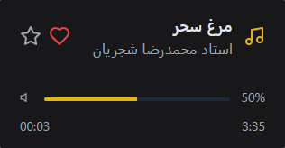

# Simple Player - پخش‌کننده ساده و مدرن

یک پخش‌کننده موسیقی ساده و زیبا با رابط کاربری مدرن که با React و TypeScript ساخته شده است. این پروژه برای نمایش مهارت‌های برنامه‌نویسی و طراحی رابط کاربری تهیه شده است.

## نمونه تصویری



## نمونه تصویری پروژه

<div align="center">
  
  <p><em>نمونه تصویری از رابط کاربری Simple Player</em></p>
</div>

## تکنولوژی‌های استفاده شده

-   **React 18** - کتابخانه اصلی رابط کاربری
-   **TypeScript** - برای تایپ‌های ایمن
-   **Tailwind CSS** - برای استایل‌دهی ماژولار

## نصب و اجرا

### پیش‌نیازها

-   Node.js (نسخه 16 یا بالاتر)
-   npm یا yarn

### مراحل نصب

۱. کلون کردن پروژه:

```bash
git clone https://github.com/ehsanrashidi/react-player-card-view.git
cd simple-player
```

۲. نصب وابستگی‌ها:

```bash
npm install
```

۳. اجرای پروژه در حالت توسعه:

```bash
npm run dev
```

۴. بیلد برای تولید:

```bash
npm run build
```

## نحوه استفاده

## استفاده از کامپوننت

```tsx
import { Player } from "./components/player-card";

function App() {
    return (
        <div className="app">
            <Player />
        </div>
    );
}
```

### اطلاعات تماس

-   **نام:** احسان رشیدی
-   **تلفن:** [989134562731](tel:+989134562731)
-   **ایمیل:** [info@ehsanrashidi.ir](mailto:info@ehsanrashidi.ir)
-   **گیت‌هاب:** [github.com/ehsanrashidi](https://github.com/ehsanrashidi)
-   **اینستاگرام:** [instagram.com/ehsanrashidi.dev](https://www.instagram.com/ehsanrashidi.dev)
-   **لینکدین:** [linkedin.com/in/ehsanabdoalrashidi](https://www.linkedin.com/in/ehsanabdoalrashidi)
-   **واتساپ:** [wa.me/989134562731](https://wa.me/989134562731)
-   **وبسایت:** [ehsanrashidi.ir](https://ehsanrashidi.ir/)

---
